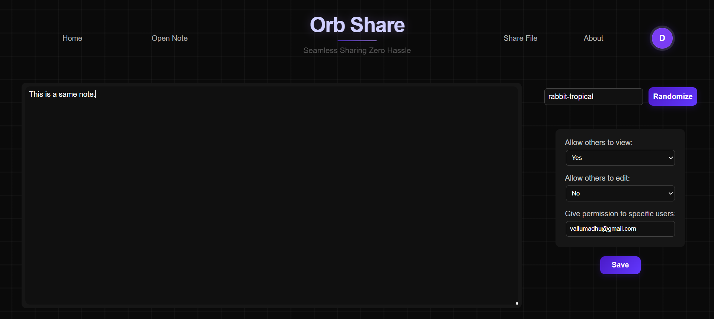
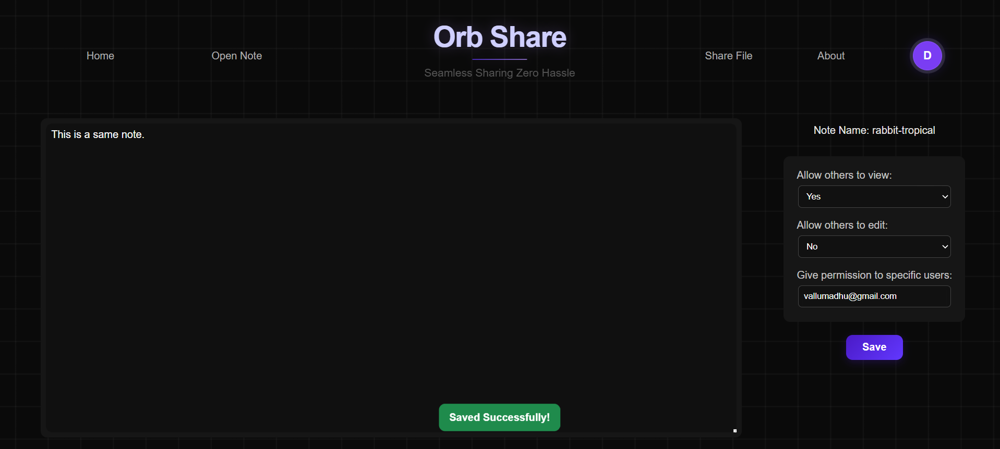
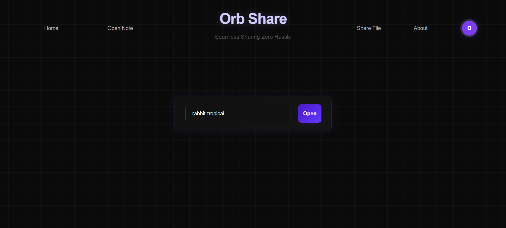
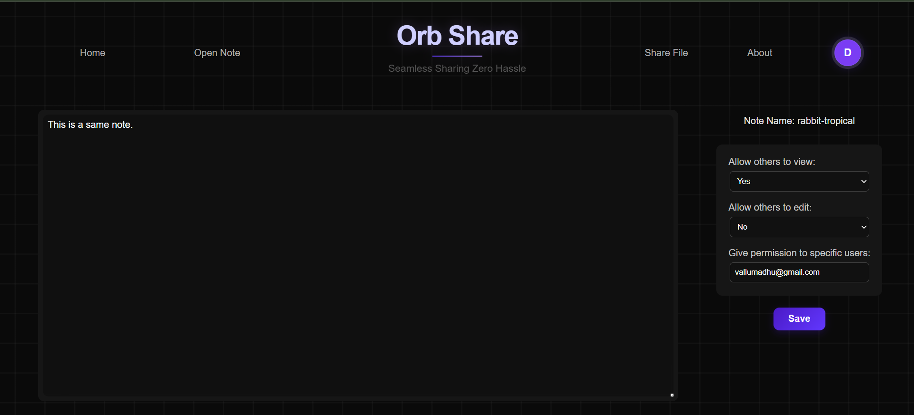

# **Orb Share**

Orb Share is a lightweight, secure, and fast platform that allows students to instantly share notes, PDFs, code files, or any text, without relying on WhatsApp Web or Gmail on public systems.

## **Why Orb Share Exists**

Using WhatsApp Web or Gmail on lab/library computers is risky. It's slow, inconvenient, and forgetting to log out can expose your private data.  
Most existing file-sharing platforms also fall short, they force you to remember random IDs, offer weak permission control, or give you no way to manage your shared content.

**Orb Share solves all of this by providing:**

- Instant sharing of text, PDFs, and code  
- Full control over view and edit permissions  
- A dashboard to track everything you’ve shared  
- Easy sharing through links or QR codes  
- Simple note access without creating heavy accounts

Orb Share is built for one purpose: **efficient, safe, student-friendly sharing.**

## **How It Works**

### **1. Create a Note**
Write your note, set view/edit permissions, and add the email(s) of users who should have access.  

### **2. Save the Note**
Click **Save** to generate a unique Note ID.  

### **3. Access a Note**
Anyone with access can open the **Open Note** page, enter the Note ID, and view it.  

### **4. View or Edit**
If their email has the right permissions, they can view or edit the note.  
